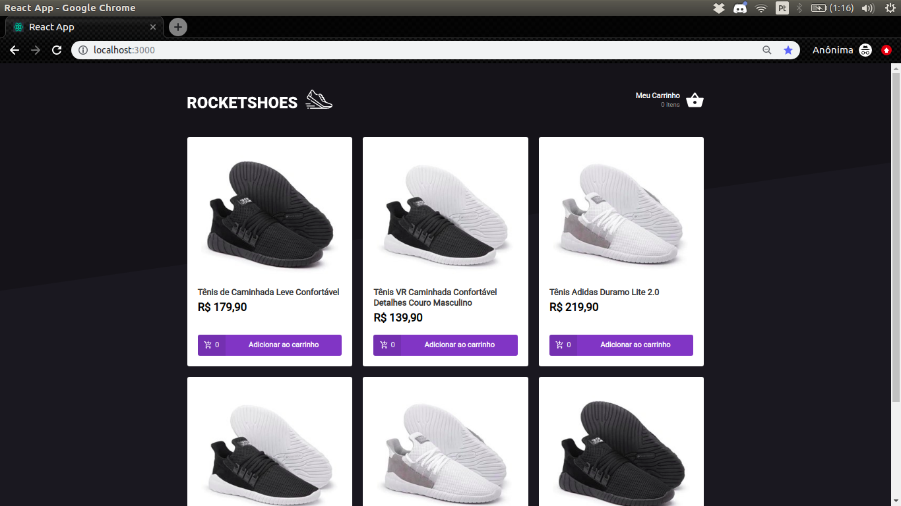

<h1 align="center">
  
</h1>

<h3 align="center">
  Rocketshoes, Frontend
</h3>

<blockquote align="center">“Mude você e todo o resto mudará naturalmente”!</blockquote>

  <a href="#-tecnologias">Tecnologias</a>&nbsp;&nbsp;&nbsp;|&nbsp;&nbsp;&nbsp;
  <a href="#-projeto">Projeto</a>&nbsp;&nbsp;&nbsp;|&nbsp;&nbsp;&nbsp;
  <a href="#-instalação-e-execução">Instalação e execução</a>&nbsp;&nbsp;&nbsp;|&nbsp;&nbsp;&nbsp;
  <a href="#-licença">Licença</a>

 

  

## 🚀 Tecnologias

Esse projeto foi desenvolvido com as seguintes tecnologias:

- [React](https://reactjs.org)

## 💻 Projeto

A aplicação desenvolvida no bootcamp da rocketseat e o objetivo é criar um app similar ao netshoes, o Rocketshoes, usando react, redux e redux-saga.

## 📥 Instalação e execução

Faça um clone desse repositório

  ### Backend
  1. A partir da raiz do projeto, rode `json-server server.json -p 3333`

  ### Frontend
  1. A partir da raiz do projeto, rode `npm install` para instalar as dependências;
  2. Rode `npm run start` para iniciar o servidor de desenvolvimento;
  3. Abra `http://localhost:3000` para ver o projeto no navegador.

## 📝 Licença

Esse projeto está sob a licença MIT. Veja o arquivo [LICENSE](LICENSE.md) para mais detalhes.